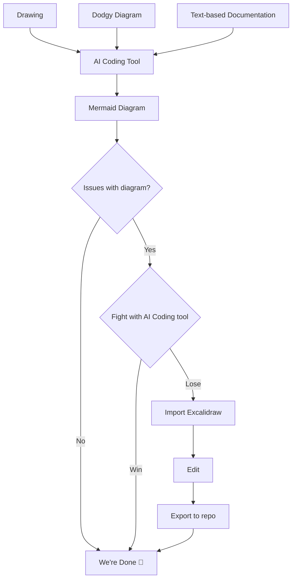

# AI Diagram Flow v2

```mermaid
flowchart TD
    A[Drawing]
    B[Dodgy Diagram]
    C[Text-based Documentation]

    D[AI Coding Tool]
    E[Mermaid Diagram]
    F{Issues with diagram?}
    K{Fight with AI Coding tool}

    G[We're Done 🥳]
    H[Import Excalidraw]
    I[Edit]
    J[Export to repo]

    A --> D
    B --> D
    C --> D

    D --> E
    E --> F

    F -->|No| G
    F -->|Yes| K
    K -->|Lose| H
    K -->|Win| G
    H --> I
    I --> J
    J --> G
```
